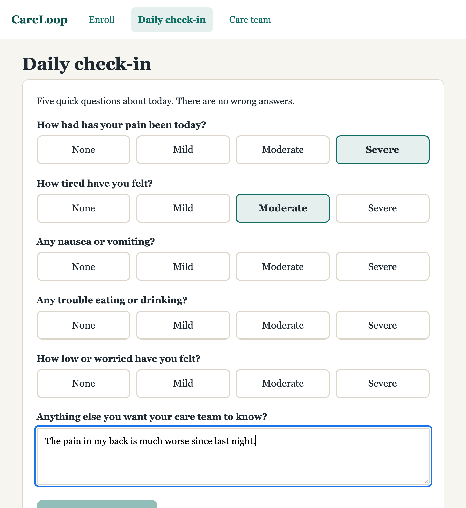
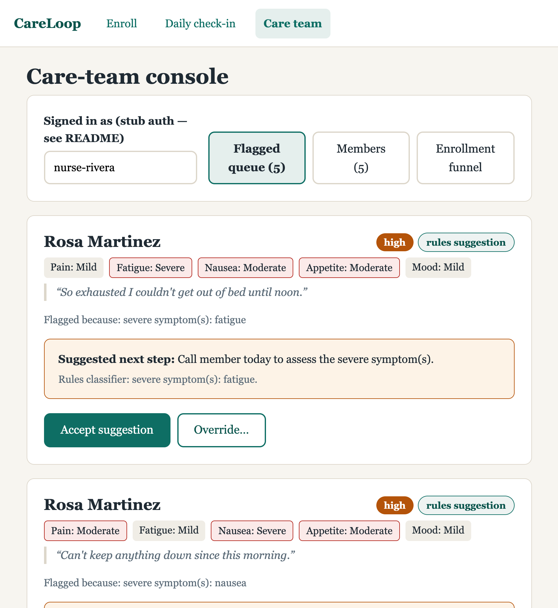
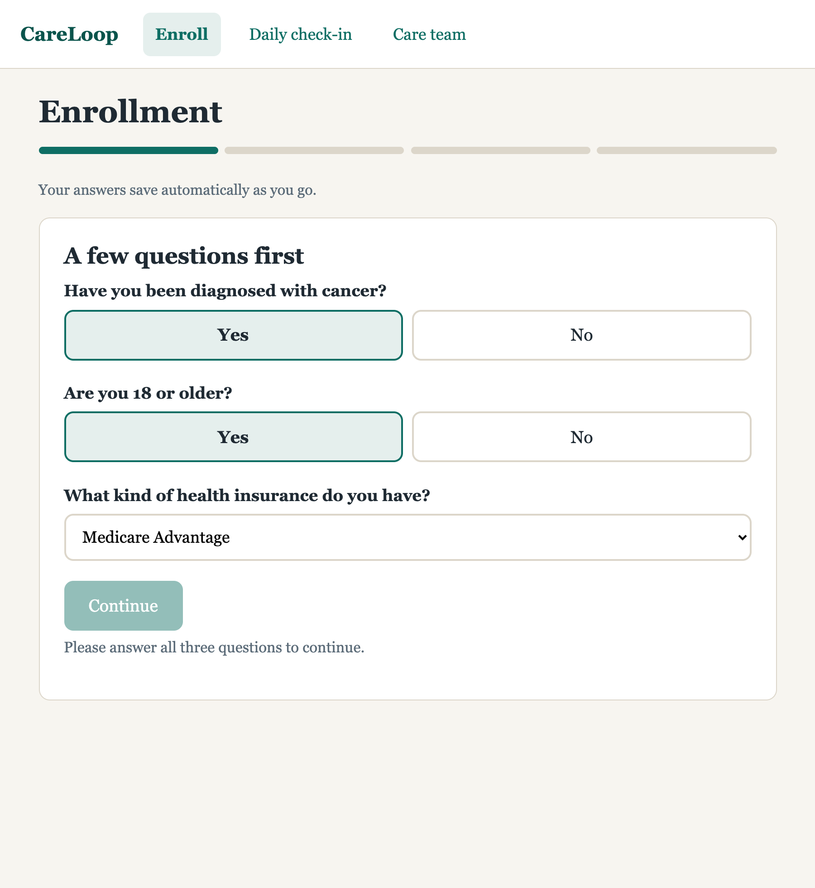
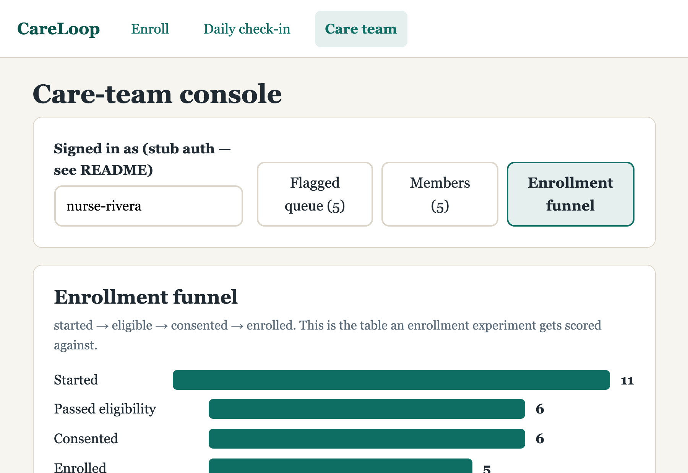

# CareLoop

[](https://github.com/jaydeepbajwa/care-loop/actions/workflows/ci.yml)

A member enrollment + symptom check-in mini-product for a cancer care-navigation service:
patients enroll and report symptoms in under a minute, an LLM drafts a triage suggestion,
and a **human care team accepts or overrides every suggestion** — nothing is ever auto-acted.

All data is synthetic. No real PHI anywhere.

| Member check-in | Care-team triage queue |
|---|---|
|  |  |

| Resumable enrollment | Enrollment funnel |
|---|---|
|  |  |

## Quickstart

```sh
git clone https://github.com/jaydeepbajwa/care-loop.git
cd care-loop
docker compose up --build
```

Open **http://localhost:8080** — the database is seeded with demo members, check-ins, and a
flagged triage queue. Three ways in:

- **Member check-in:** *Daily check-in* → "Use the demo member (Rosa)"
- **Care team:** *Care team* → review the flagged queue, accept or override suggestions
- **New member:** *Enroll* → walk the eligibility → consent → contact flow

No API keys required. If you add `ANTHROPIC_API_KEY` to a `.env` file (see `.env.example`),
triage suggestions are drafted by Claude; without it, a deterministic rules classifier
produces them and the product works identically.

<details>
<summary>Running without Docker</summary>

```sh
# API (needs a local Postgres, or export DATABASE_URL)
cd server && python3 -m venv .venv && .venv/bin/pip install -e ".[dev]"
.venv/bin/python -m app.seed
.venv/bin/uvicorn app.main:app --reload

# Web
cd web && npm install && npm run dev   # http://localhost:5173, proxies to :8000
```
</details>

## What it does

**Member side** — built for sick, often older users: 18px base type, 52px+ touch targets,
visible focus rings, one obvious action per screen.

- **Enrollment**: eligibility questions → consent → contact preferences. Every step
  autosaves; the browser keeps a resume token so a member can stop mid-flow and come back
  days later.
- **Symptom check-in**: five 0–3 scales (pain, fatigue, nausea, appetite, mood) plus a
  free-text "anything else?" — deliberately under 60 seconds.

**Care-team side**

- **Flagged queue**: check-ins that need attention, sorted by severity, each with a
  suggested next step, its rationale, and its source (`llm` vs `rules`) displayed.
- **Accept / override**: a suggestion stays `pending` until a named human decides.
  Overrides record the correction *next to* the untouched original suggestion, and every
  lifecycle event lands in an append-only audit log.
- **Enrollment funnel**: started → eligible → consented → enrolled event counts — the table
  an enrollment experiment would be scored against.

## Design decisions I'd defend in an interview

1. **The LLM can suggest, never act — and never un-flag.** Deterministic rules decide *if*
   a check-in needs attention (severe scores, red-flag phrases). Claude only drafts the
   severity + next step for a human to review, via structured output
   (`client.messages.parse` with a Pydantic schema) so a malformed response is an exception,
   not a corrupted queue. If the LLM call fails for any reason, triage degrades to the rules
   classifier and the failure is logged and counted — the member's check-in never fails
   because triage did.

2. **Check-in persistence commits before triage runs.** A patient took the time to say how
   they feel; that write is the thing that must not be lost. Triage runs after the commit,
   in its own transaction. The error message on a failed save tells the member their
   answers are still on the page.

3. **The funnel is an append-only event table, not columns on the member row.** Funnel
   events (`started`, `eligibility_passed/failed`, `consent_given`, `enrolled`) are how
   experiments get measured; deriving them from mutable state loses history. The core test
   suite asserts monotonicity: `started ≥ eligible ≥ consented ≥ enrolled`, always.

4. **Overrides preserve the original.** `severity`/`suggested_action` columns are written
   once by the system; human corrections go to `final_severity`/`final_action`. Months
   later you can still answer "what did the model say, and what did the nurse do?" — which
   is also exactly the dataset you'd need to evaluate and improve the model.

## Observability

- **Structured JSON logs** — one object per line on stdout in Datadog-ingestible shape
  (`status`, `message`, nested `http.*`, `duration_ms`, `request_id`). Point the Datadog
  agent at the container and facets work with zero parsing config.
- **`/metrics`** — per-route p50/p99 latency and counters, including
  `checkin_submit_errors_total` and `triage_llm_failures_total`.
- **`/health`** — probes the database, returns 503 when degraded.

**The on-call alert I'd wire first** (the JD puts new engineers in the rotation): page on
`checkin_submit_errors_total > 0` sustained for 5 minutes — a member telling us they feel
terrible and us dropping it is the worst failure this product has. Second alert: warn on
`triage_llm_failures_total` rate spike — the product degrades gracefully to rules, but the
care team should know suggestion quality changed.

## Tests

Tests cover the two invariants this repo exists to prove, not the glue:

- **Funnel monotonicity** — steps can't be skipped, counts never invert, completion is
  idempotent (`server/tests/test_enrollment_funnel.py`)
- **Human-in-the-loop** — suggestions never act on their own, overrides preserve the
  original, decisions are final and audited, and a simulated LLM outage degrades to rules
  without losing the check-in (`server/tests/test_triage.py`)

```sh
cd server && .venv/bin/pytest        # 19 tests
cd web && npm test                   # check-in form domain logic
```

## Stack

Vue 3 + TypeScript + Vite · FastAPI + SQLAlchemy 2 + Postgres · Anthropic API (structured
output) · Docker Compose · GitHub Actions.

**Honesty note:** this is my first Vue project (my background is React). I built it in Vue
deliberately because the team I'm interviewing with ships Vue — the component model
(SFCs, `ref`, computed) mapped over from React hooks faster than expected.

## Honest limits

- **Auth is stubbed.** Members hold an opaque token in localStorage; care-team endpoints
  trust an `X-Care-Team` header. Real versions: OTP over SMS/email for members (they won't
  manage passwords), SSO + RBAC for staff. The token boundary is already in one place per
  side, so swapping it in is localized.
- **No migrations.** `create_all` on startup is fine for a demo; production gets Alembic
  before the first schema change.
- **Metrics are in-process** and reset on restart; they'd be DogStatsD emissions in
  production (names already follow that convention).
- **The rules classifier is deliberately paranoid** (broad phrase list, coarse scores).
  Tuning false-positive rate against real triage outcomes is a product decision that needs
  clinical input, not something to guess at in a demo.
- **`urgent` free-text detection is keyword-based in the fallback path.** A member writing
  "no chest pain today" still flags. Acceptable trade: in triage, false positives cost a
  phone call; false negatives cost far more.

## License

[MIT](LICENSE) — see also the [CHANGELOG](CHANGELOG.md).
